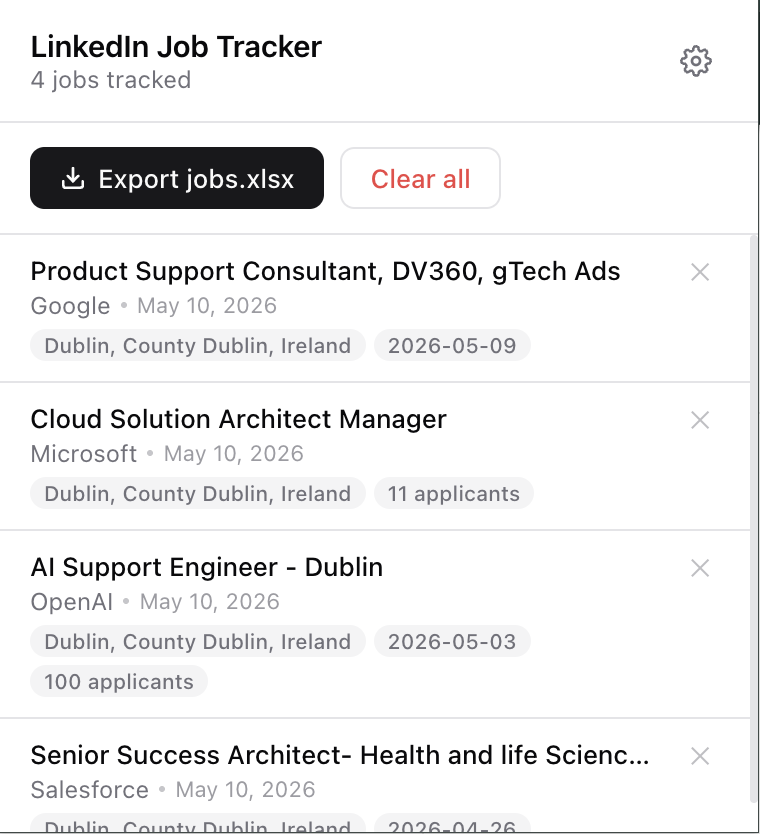

# Job Application Optimizer

Automatically score LinkedIn jobs against your resume and generate a tailored PDF resume for every strong match — one per job, in one command.



## How it works

```
jobs.xlsx  →  Claude/Gemini scores each job  →  resumes/*.pdf
```

1. You browse LinkedIn and save jobs using the bundled **LinkedIn Job Tracker** Chrome extension
2. You export your tracked jobs as `jobs.xlsx` from the extension popup
3. You open this folder in **Claude Code** or **Gemini CLI** and say `start`
4. The agent scores every job (0–100) against your resume, then generates a tailored PDF for every job scoring ≥ 65

---

## Setup

### 1. Install the LinkedIn Job Tracker Chrome extension

Load the unpacked extension from the `linkedin-job-tracker/` folder:

1. Open Chrome → go to `chrome://extensions`
2. Enable **Developer mode** (top-right toggle)
3. Click **Load unpacked** → select the `linkedin-job-tracker/` folder
4. The extension icon appears in your toolbar

### 2. Save jobs from LinkedIn

1. Go to [LinkedIn Jobs](https://www.linkedin.com/jobs/)
2. Open any job description
3. Click **+ Track** (yellow button in the job detail panel)
4. Repeat for every job you want to include

### 3. Export your job list

1. Click the extension icon in Chrome
2. Click **Export jobs.xlsx**
3. Move the downloaded file to this folder

### 4. Add your resume

Place your resume in this folder as either:
- `resume.tex` — LaTeX format
- `resume.docx` — Word format

### 5. Install Claude Code or Gemini CLI

Pick one:

**Claude Code** (recommended)
```bash
npm install -g @anthropic-ai/claude-code
```
Then open this folder and run:
```bash
claude
```

**Gemini CLI**
```bash
npm install -g @google/gemini-cli
```
Then open this folder and run:
```bash
gemini
```

Once the CLI is running, say:

```
start
```

The agent runs preflight checks, scores all jobs, and writes tailored PDFs to `resumes/`.

---

## Output

After a run you'll have:

| File | Description |
|------|-------------|
| `jobs.xlsx` | Updated with `fit_score`, `fit_reasoning`, `resume_path` columns |
| `results.jsonl` | Raw scoring output |
| `resumes/*.pdf` | Tailored resume PDF for each job that scored ≥ 65 |

---

## Requirements

| Tool | Purpose | Install |
|------|---------|---------|
| Python 3 | Read/write Excel | `brew install python` |
| openpyxl | Python xlsx library | `pip3 install openpyxl` |
| pdflatex | Compile `.tex` resumes | `brew install --cask mactex-no-gui` |
| pandoc | Convert `.docx` resumes to PDF | `brew install pandoc` |

The agent checks all dependencies at startup and tells you exactly what to install if anything is missing.

---

## File structure

```
jobs_marco/
├── README.md
├── CLAUDE.md                  ← Claude Code agent instructions
├── GEMINI.md                  ← Gemini CLI agent instructions
├── resume_optimizer_skill.md  ← Resume tailoring rules (XYZ formula)
├── resume.tex                 ← Your base resume in LaTeX (not committed)
├── resume.docx                ← Your base resume in Word (not committed)
├── jobs.xlsx                  ← Exported from the extension (not committed)
├── results.jsonl              ← Generated during a run (not committed)
├── linkedin-job-tracker/          ← LinkedIn Job Tracker extension source
│   ├── manifest.json
│   ├── content.js
│   ├── content.css
│   ├── popup.html
│   ├── popup.js
│   ├── background.js
│   └── xlsx.mini.min.js
└── resumes/                   ← Generated PDFs (not committed)
    ├── Stripe_PM.pdf
    └── ...
```

---

## Resume format notes

**LaTeX (`.tex`):** The agent edits the `.tex` source and compiles it with `pdflatex`. Produces the cleanest PDFs.

**Word (`.docx`):** The agent edits the `.docx` and converts to PDF with `pandoc`. No LaTeX installation needed.

Either format produces one PDF per matched job in `resumes/`.
